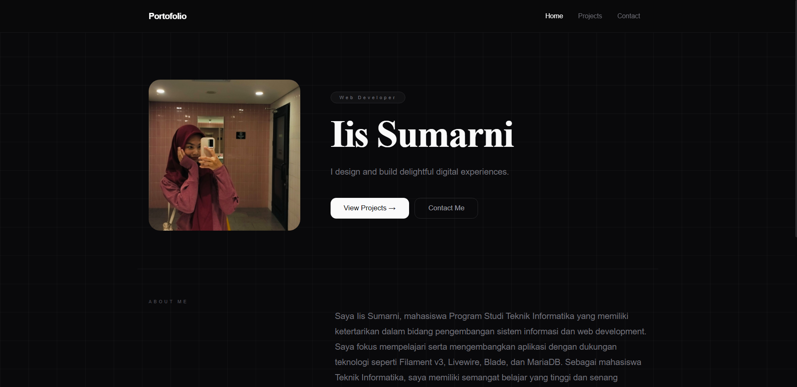
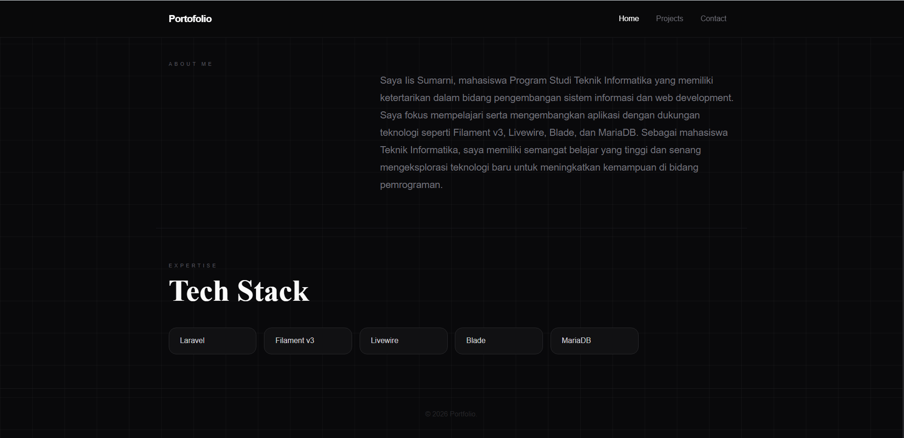
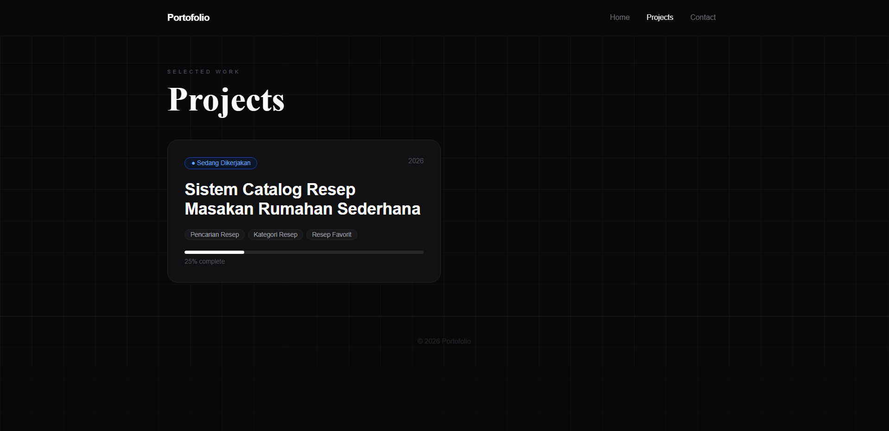
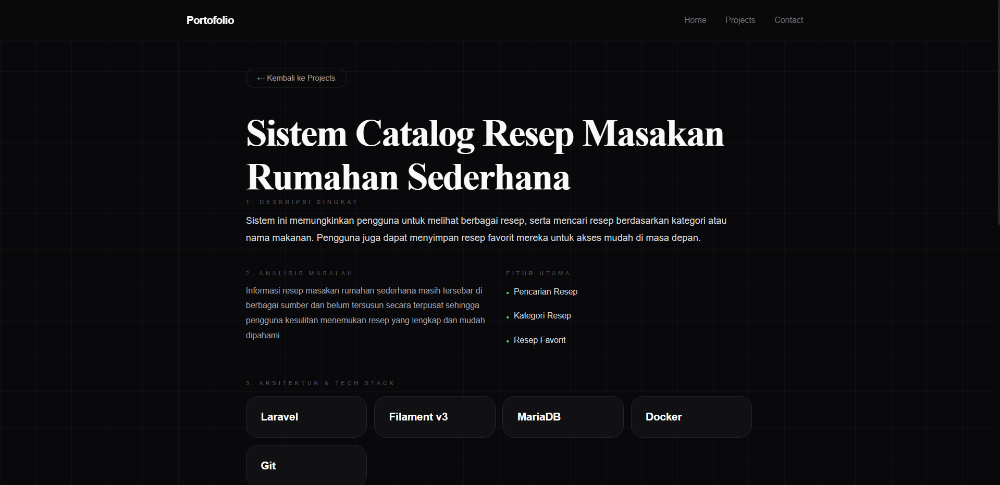
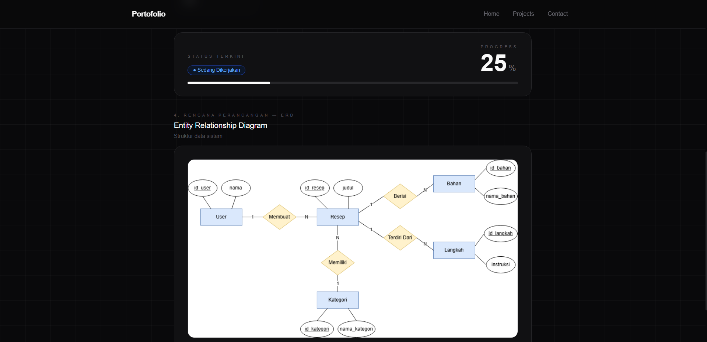
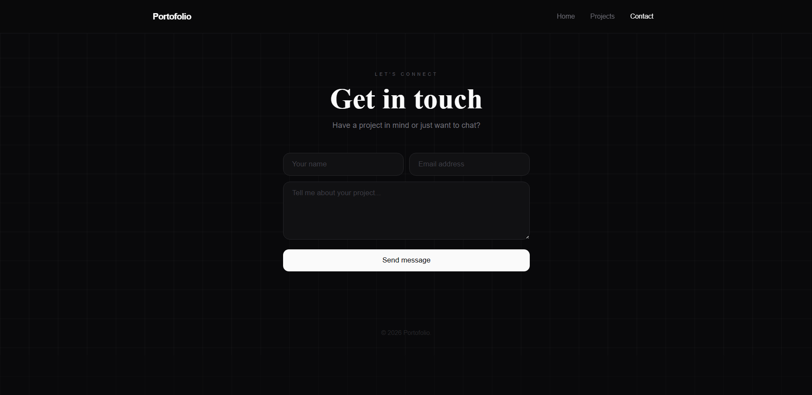
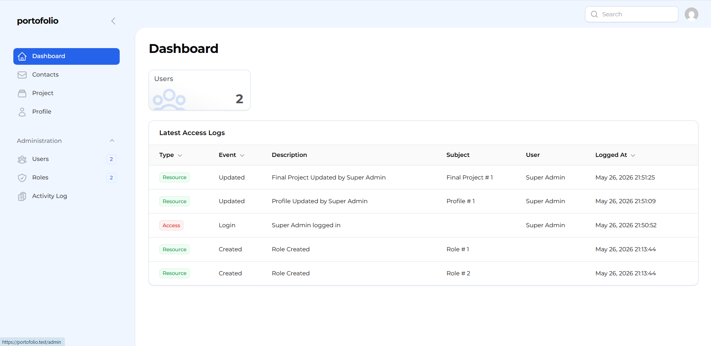

# 🌐 Personal Portfolio Website

## 📖 Deskripsi Project

Personal Portfolio Website merupakan aplikasi berbasis web yang digunakan untuk menampilkan profil pribadi, daftar project yang pernah dikerjakan, serta menyediakan media komunikasi melalui halaman kontak.

Website ini dibangun menggunakan Laravel Framework, Filament v3 Admin Panel, Livewire, Blade, MariaDB, dan Docker. Seluruh data portfolio dapat dikelola secara dinamis melalui panel administrasi tanpa perlu mengubah source code secara langsung.

---

## 👨‍🎓 Informasi Mahasiswa

| Keterangan | Data |
|------------|------|
| Nama | Iis Sumarni |
| NIM | 20240801095 |
| Program Studi | Teknik Informatika |
| Fakultas | Fakultas Ilmu Komputer |
| Universitas | Universitas Esa Unggul |
| Angkatan | 2024 |

---

## 🎯 Tujuan Project

- Menampilkan profil dan informasi pengembang secara profesional.
- Menjadi media dokumentasi project yang sedang maupun telah dikerjakan.
- Menampilkan perkembangan (progress) project secara visual.
- Memudahkan pengelolaan data portfolio melalui admin panel.
- Menyediakan sarana komunikasi antara pengunjung dan pemilik portfolio.

---

## ✨ Fitur Utama

### 👤 Profile Management

- Upload Foto Profil
- Badge Profesi
- Nama Lengkap
- Tagline
- About Me
- Manajemen Tech Stack

### 📂 Project Management

- CRUD Project
- Analisis Masalah
- Fitur Utama
- Tech Stack Project
- Status Project
- Progress Project (%)
- Upload ERD Project
- Tahun Project

### 📨 Contact Management

- Form Contact
- Penyimpanan Pesan Pengunjung
- Manajemen Pesan Melalui Admin Panel

### 🔐 Admin Panel

- Login Administrator
- Dashboard Filament
- Manajemen Profile
- Manajemen Project
- Manajemen Contact
- Manajemen User dan Role

---

## 🏗️ Teknologi yang Digunakan

| Teknologi | Keterangan |
|------------|------------|
| Laravel  | Backend Framework |
| Filament v3 | Admin Panel |
| Livewire | Reactive Component |
| Blade | Frontend Template |
| MariaDB | Database |
| Docker | Containerization |
| Nginx | Web Server |
| PHP 8.3 | Programming Language |
| GitHub | Version Control |
| VS Code | Code Editor |

---

# 🗂️ Struktur Database

Tabel utama yang digunakan:

```text
profiles
final_projects
contacts
users
roles
```

---

## 📂 Struktur Modul

### Profile

Mengelola informasi profil pemilik portfolio:

- Foto Profil
- Nama
- Badge
- Tagline
- About Me
- Tech Stack

### Project

Mengelola data project:

- Judul Project
- Deskripsi
- Analisis Masalah
- Fitur Utama
- Tech Stack
- Status Project
- Progress Project
- ERD
- Tahun Project

### Contact

Mengelola pesan dari pengunjung website:

- Nama
- Email
- Pesan

---

## 👥 Hak Akses Pengguna

### Administrator

- Mengelola Profile
- Mengelola Project
- Mengelola Contact
- Mengelola User
- Mengakses Dashboard

### Pengunjung

- Melihat Profil
- Melihat Daftar Project
- Melihat Detail Project
- Mengirim Pesan Melalui Contact Form

---

# ⚙️ Kebutuhan Sistem

- Docker
- Docker Compose
- PHP 8
- Composer
- Git

---

# ▶️ Contoh Penggunaan

## Menjalankan Website

Buka browser:

```text
http://portfolio.test
```
---

## Login Admin Panel

```text
http://portfolio.test/admin
```

Masukkan akun administrator yang telah dibuat.

---

## Mengelola Profile

- Upload foto profil
- Mengubah nama
- Mengubah badge profesi
- Mengubah tagline
- Mengubah deskripsi About Me
- Mengelola daftar Tech Stack

---

## Mengelola Project

- Menambah project baru
- Mengubah progress project
- Mengunggah ERD
- Mengubah status project
- Mengelola detail project

---

## Mengelola Contact

- Melihat pesan dari pengunjung
- Menambah data contact
- Menghapus data contact

---

## 🐳 Custom Command

| Command | Deskripsi |
|----------|------------|
| `dcu` | Docker Compose Up |
| `dcd` | Docker Compose Down |
| `dca` | PHP Artisan |
| `dcm` | Generate Model, Migration, Seeder, Controller, dan Filament Resource |

### Contoh

Membuat resource baru:

```bash
dcm Portfolio
```

---

## 📸 Tampilan Sistem

### Home Page




Menampilkan:

- Foto Profil
- Nama
- Tagline
- About Me
- Tech Stack

### Project Section



Menampilkan:

- Daftar Project
- Progress Project
- Status Project
- Detail Project

### Detail Project 




Menampilkan:

- Judul Project
- Deskripsi Singkat
- Analisis Masalah 
- Fitur Utama
- Tech Stack
- Progress
- ERD

### Contact Section



Menampilkan:

- Form Pengiriman Pesan

### Dashboard Admin



Menampilkan:

- Data Profile
- Data Project
- Data Contact

---

## 📊 Metode Pengembangan

Project dikembangkan menggunakan metode Agile Development:

1. Planning
2. Analysis
3. Design
4. Development
5. Testing
6. Deployment
7. Maintenance

---

## 🎓 Informasi Project

**Nama Project:**

Personal Portfolio Website

**Platform:**

Website

**Framework:**

Laravel + Filament v3

**Tahun:**

2026

---